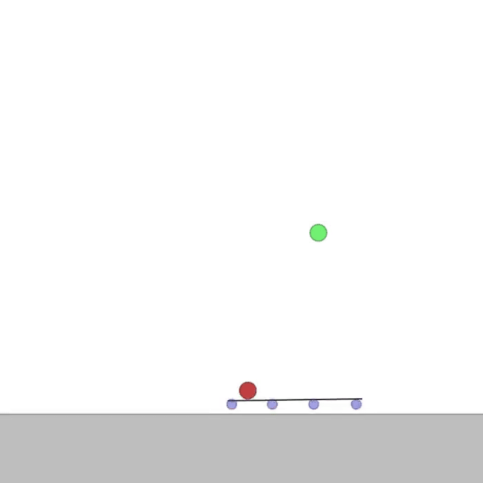
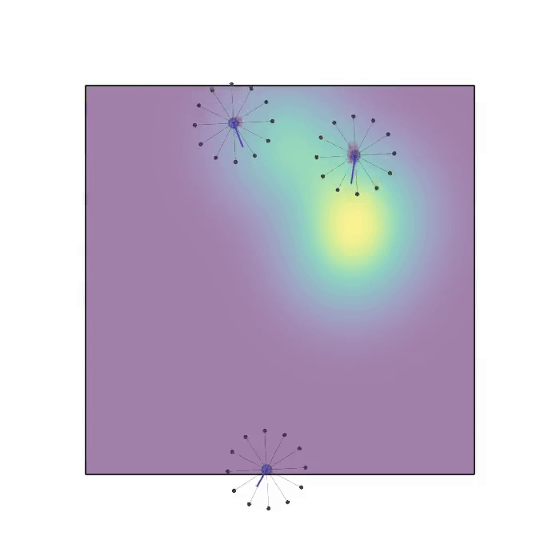

# Project for course Agent-based systems

Authors: Jana Angeloska 226040 & Dragana Usovikj 221043

# Environments

<table>
  <tr>
    <td align="center">
      
      <br/>
      <b>Balance</b>
    </td>
    <td align="center">
      
      <br/>
      <b>Sampling</b>
    </td>
  </tr>
</table>

# BenchMARL Setup

The setup is based on the [official BenchMARL repository](https://github.com/facebookresearch/BenchMARL).

## Prerequisites
- Python 3.11

## Quick Setup (Windows)

### Step 1: Set Python Version to 3.11

Ensure your project is using Python 3.11 as the interpreter.

### Step 2: Update pip

Open your terminal and update pip to the latest version:

```bash
python.exe -m pip install --upgrade pip
```

### Step 3: Install Core Dependencies

Install the following packages in order:

```bash
pip install torchrl
pip install benchmarl
pip install vmas
```

## Verification

Test your installation with this simple script:

```python
import torch
import time
from vmas import make_env

env = make_env(
    scenario="simple_spread",
    num_envs=1,
    n_agents=3,
)

obs = env.reset()
print("Number of agents:", len(obs))
print("Obs shape per agent:")
for i, o in enumerate(obs):
    print(f"Agent {i}: {o.shape}")

for _ in range(5):
    actions = []
    for agent_action_space in env.action_space:
        a = agent_action_space.sample()
        a = torch.tensor(a).unsqueeze(0)
        actions.append(a)
    
    obs, rewards, dones, info = env.step(actions)
    time.sleep(1)
    env.render()
    print("Rewards:", rewards)
```

### Expected Output

```
Number of agents: 3
Obs shape per agent:
Agent 0: torch.Size([1, 14])
Agent 1: torch.Size([1, 14])
Agent 2: torch.Size([1, 14])
Rewards: [tensor([-9.8281]), tensor([-9.8281]), tensor([-9.8281])]
Rewards: [tensor([-9.0799]), tensor([-9.0799]), tensor([-9.0799])]
...
```

## What's Included

After completing this setup, you will have:

- **BenchMARL framework**: For running multi-agent reinforcement learning experiments
- **VMAS environment**: For continuous multi-agent tasks

## Other dependencies
Also install these dependencies if you haven't already, needed for plotting the results:
```bash
pip install matplotlib
pip install pandas
```

## Troubleshooting

### WSL Alternative (Not Recommended)

While Windows Subsystem for Linux (WSL) was attempted to resolve compatibility issues with DMLab2D and MeltingPot, it was ultimately unsuccessful due to:

- Incomplete package distributions (missing level scripts)
- Unresolved dependency conflicts
- Runtime errors that persisted despite manual intervention

**Recommendation**: Stick with the working setup outlined above for Windows development.

### Dependency Conflicts

If you encounter dependency conflicts:

1. Ensure you're using Python 3.11
2. Create a fresh virtual environment

## Additional Resources

- [BenchMARL GitHub Repository](https://github.com/facebookresearch/BenchMARL)
- [VMAS Documentation](https://github.com/proroklab/VectorizedMultiAgentSimulator)

## License

Please refer to the individual licenses of BenchMARL, TorchRL, VMAS for usage terms.

